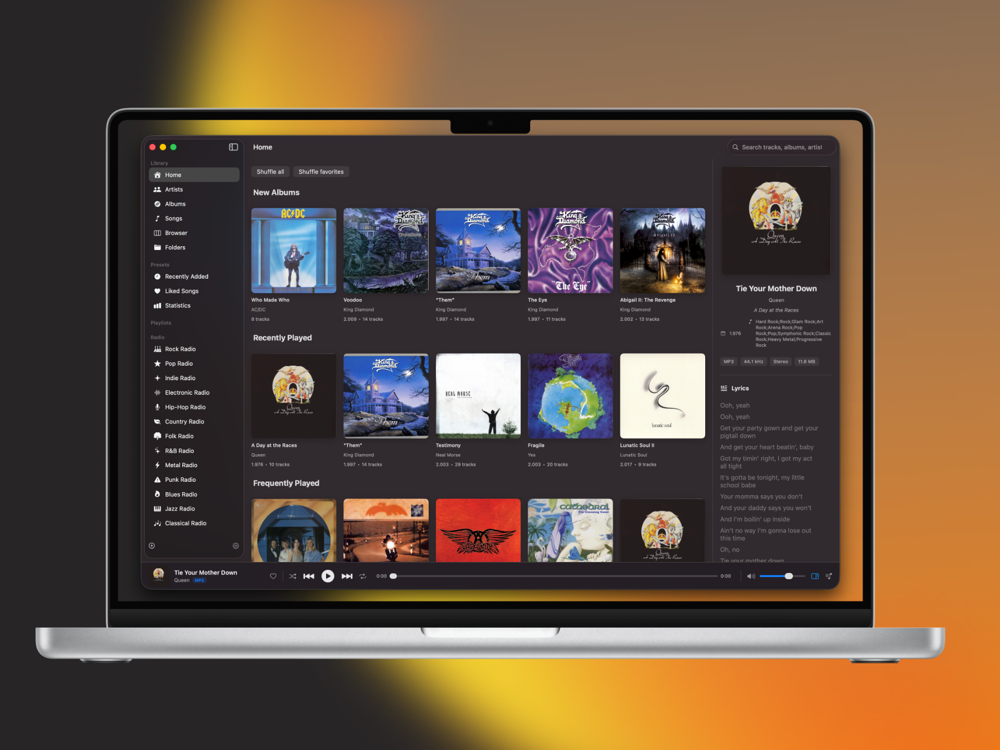
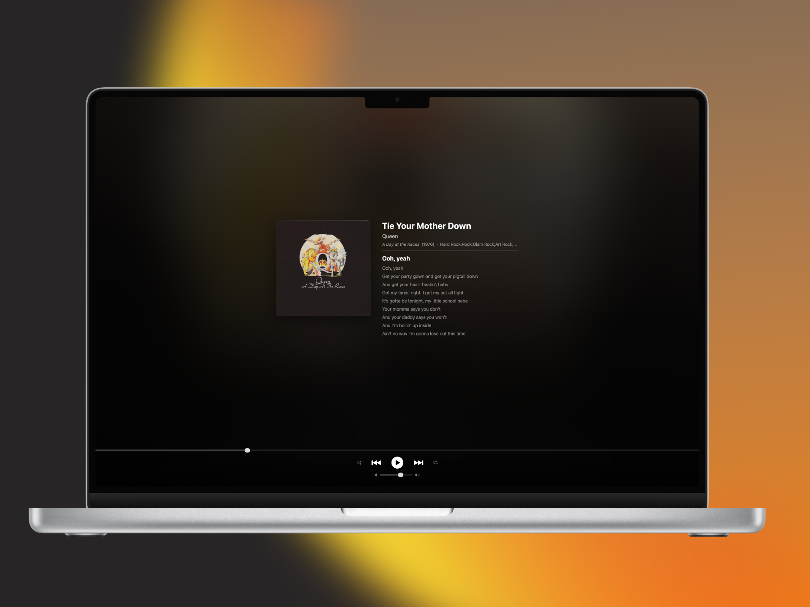
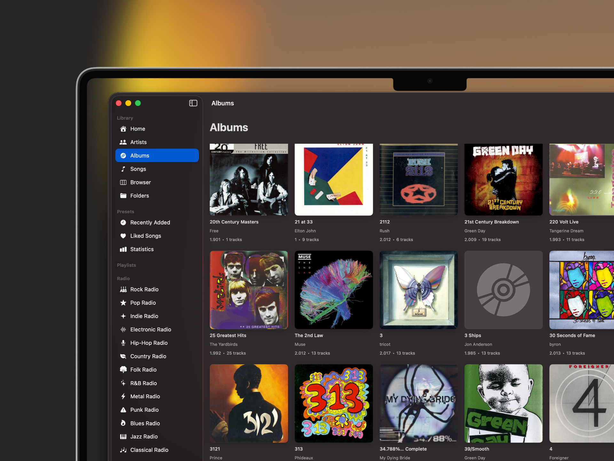
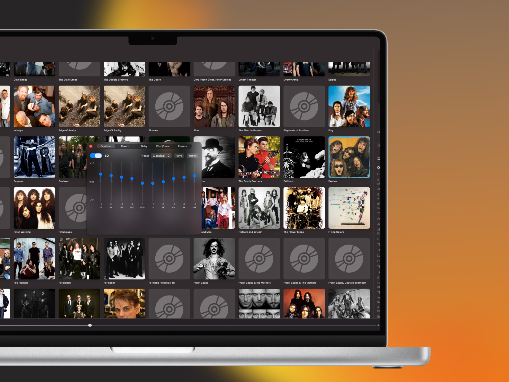

<p align="center">
  
</p>

<h1 align="center">Orange Music Player</h1>

<p align="center">
  A native macOS music player for audiophiles who own their music.
</p>

<p align="center">
  
  
  
  
  
</p>

<br />

<p align="center">
  
</p>

<br />

Orange Music Player is a fast, privacy-first music player built entirely with SwiftUI for macOS Sonoma and later. It plays every major lossless and lossy format with bit-perfect output, gapless playback, and a full suite of audio effects -- all without subscriptions, ads, or telemetry.

---

## Features

### Playback

Bit-perfect audio powered by [SFBAudioEngine](https://github.com/sbooth/SFBAudioEngine) with support for high-resolution and DSD content.

| Capability | Details |
|---|---|
| Formats | FLAC, ALAC, DSD (DoP), WAV, AIFF, MP3, AAC, OGG Vorbis, WMA, APE, WavPack, Opus, Musepack |
| CUE Sheets | Full CUE sheet parsing for single-file albums |
| Gapless | Seamless track transitions for live albums and classical music |
| Crossfade | Adjustable 1--10 second crossfade between tracks |
| Normalization | ReplayGain volume normalization (track and album modes) |

### Audio Effects

A built-in signal processing chain with real-time preview.

| Effect | Details |
|---|---|
| Parametric EQ | 10-band with built-in presets |
| Reverb | 13 room presets (small room to cathedral) |
| Delay | Adjustable delay with feedback control |
| Pitch / Speed | Independent pitch shifting and playback speed |
| Combined Presets | Slowed + Reverb, Nightcore, and more |

### Now Playing

<p align="center">
  
</p>

- **Immersive mode** -- full-screen album art experience
- **Mini player** -- compact floating window
- **Synced lyrics** -- LRC lyrics with click-to-seek
- **Dynamic theming** -- interface colors adapt to album artwork

### Library Management

<p align="center">
  
</p>

| Feature | Details |
|---|---|
| Browsing | Albums, artists, songs with A--Z section index |
| Smart Playlists | Rule-based criteria with auto-updating results |
| Ratings | 1--5 star ratings and favorites |
| Column Browser | iTunes-style column browser for fast filtering |
| Folder Browser | Direct folder navigation, ideal for NAS libraries |
| Queue | Drag-and-drop queue management |
| Recently Added | Time-filtered view of new additions |

### Audio Effects

<p align="center">
  
</p>

### Statistics

- Listening history with charts
- Play counts per track, album, and artist
- Top artists, albums, and tracks over time

### Integration

| Integration | Details |
|---|---|
| Last.fm | Scrobbling with offline queue support |
| Media Keys | System media key and Now Playing integration |
| Keyboard Shortcuts | Full keyboard control for all actions |
| Remote Control | Control playback over your local network |

### Audio Output

| Feature | Details |
|---|---|
| Exclusive / Hog Mode | Lock the audio device for uninterrupted output |
| Sample Rate Switching | Automatic sample rate matching to source material |
| Integer Mode | DAC-direct integer output for compatible hardware |
| Bit-Perfect Path | Unaltered signal from file to DAC |

### Other

- **Track metadata editor** -- edit tags directly in the app
- **Artwork picker** -- fetch artwork from MusicBrainz, iTunes, or local files
- **Library verifier** -- scan for missing or corrupt files

---

## Supported Formats

| Lossless | Lossy | Other |
|---|---|---|
| FLAC | MP3 | CUE Sheets |
| ALAC | AAC | DSD (DoP) |
| WAV | OGG Vorbis | |
| AIFF | WMA | |
| WavPack | Opus | |
| APE | Musepack | |

---

## System Requirements

| | Minimum |
|---|---|
| **OS** | macOS 14.0 (Sonoma) |
| **Architecture** | Apple Silicon |
| **Xcode** | 15.0+ (build from source) |

---

## Installation

### Mac App Store

*Coming soon.*

### Build from Source

```bash
git clone https://github.com/nicorescu/Orange-Music-Player.git
cd Orange-Music-Player
open MusicPlayer.xcodeproj
```

Select your target in Xcode and press **Cmd + R** to build and run. All dependencies are resolved automatically via Swift Package Manager.

---

## Privacy

Orange Music Player is built with a strict privacy-first approach:

- **No telemetry** -- the app never phones home
- **No analytics** -- no usage data is collected
- **No accounts** -- no sign-up required
- **Local only** -- your library data stays on your Mac
- **Optional scrobbling** -- Last.fm integration is entirely opt-in

---

## Contributing & Support

Contributions, bug reports, and feature requests are welcome.

- **Issues**: [GitHub Issues](https://github.com/nicorescu/Orange-Music-Player/issues)
- **Email**: [cristianv.paraschiv@gmail.com](mailto:cristianv.paraschiv@gmail.com)

---

## Acknowledgments

Orange Music Player is made possible by these outstanding projects and services:

| Project | Role |
|---|---|
| [SFBAudioEngine](https://github.com/sbooth/SFBAudioEngine) | Audio decoding and playback engine by Stephen F. Booth |
| [MusicBrainz](https://musicbrainz.org) | Open music metadata database |
| [Cover Art Archive](https://coverartarchive.org) | Album artwork repository |
| [Last.fm](https://www.last.fm) | Music scrobbling and listening history |
| [LRCLIB](https://lrclib.net) | Synced lyrics database |

---

<p align="center">
  Made by <a href="https://github.com/nicorescu">Cristi Paraschiv</a>
</p>
